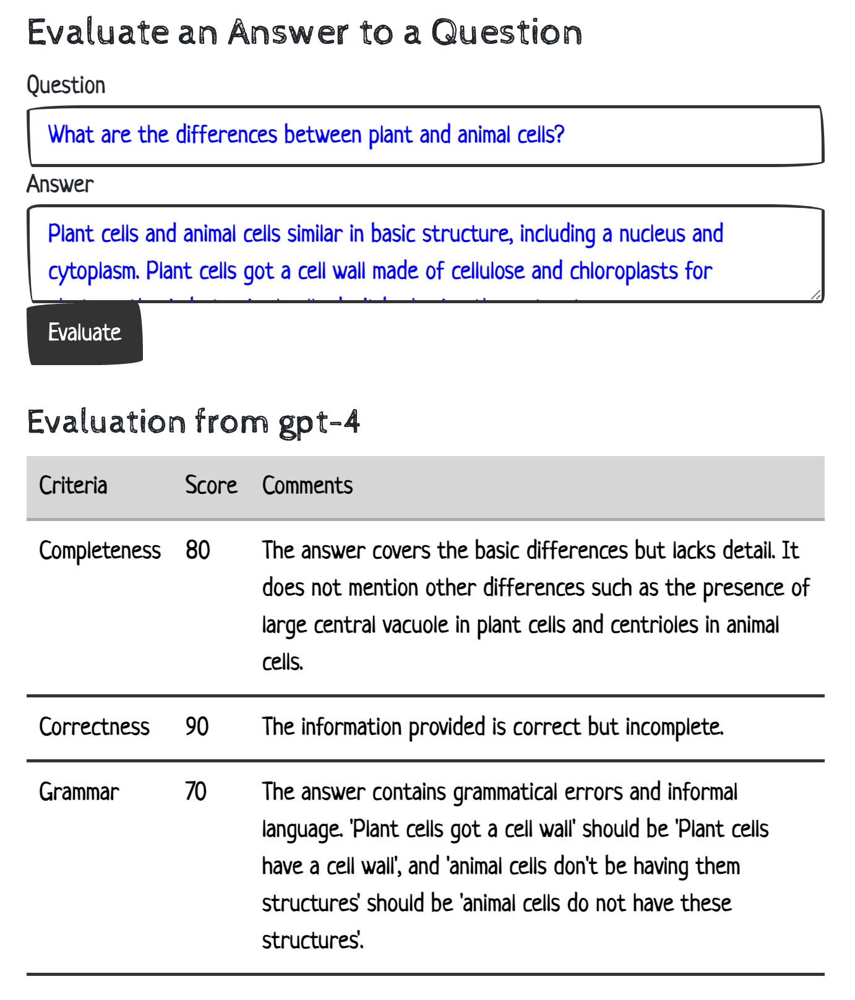

# AnswerEvaLLM

An experiment on using LangChain with an LLM to evaluate the quality of an answer to a question.



## Setup and run

```
> git clone https://github.com/adnantium/answerEvallm.git
	...
> cd answerEvallm/
> poetry install
	...
> export OPENAI_API_KEY='abc123-you-key-from-openai-keep-it-safe'
> python answer_eval_server.py
	...
```

Then check out:
* http://localhost:8000/qa
* http://localhost:8000/answer_eval/playground/

You can also invoke endpoint directly:
```
curl --location 'http://localhost:8000/answer_eval/invoke/' \
--header 'Content-Type: application/json' \
--data '{
        "input": {
            "question": "What are the differences and similarities of plant and animal cells?",
            "answer": "Both plant and animal cells have many organelles in common. They both include organelles such as ribosomes, mitochondrion, nuclei, and cell membranes. Plant cells also contain a cell wall, which animal cells do not contain."
        }
    }'
```

