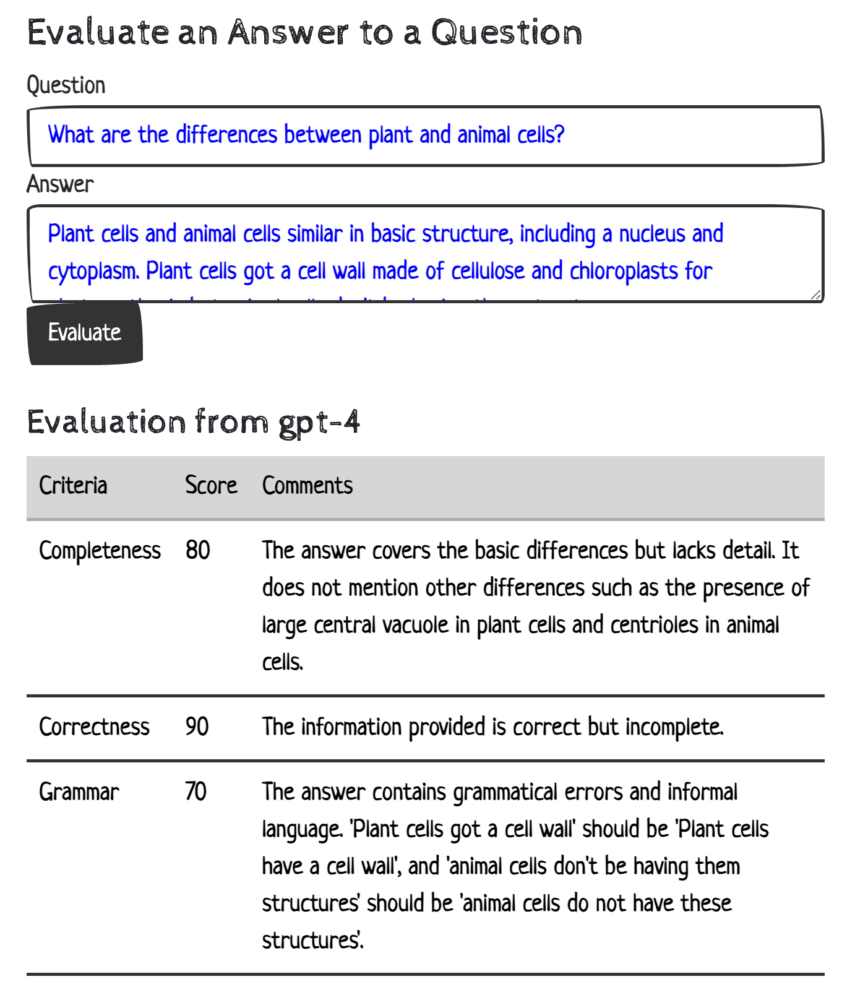

# Evaluating the quality of an answer to a question using Generative AI

LLMs love to generate answers to questions. But what if we already have an answer to a question and we want to understand its quality? LLMs can do that too. 

This usecase will help us illustrate how to do this with LangChain and an LLM.

We'll ilustrate how to use LangChain to evaluate the quality of an answer to a question using an LLM.

LangChain is a framework for building and deploying applications such as chatbots, agents that utilize language models and integrate with external tools and services. It has recently become very popular very fast and is rapidly evolving every day.

We'll explore some key aspects of LangChain such as:
* Creating a prompt
* Connecting to an LLM
* Parsing the output

We'll utilize a prompt that contains our evaluation criteria and output format specification along with the question and answer we're evaluating.

An example of evaluation criteria is:
    **Completeness**: The extent to which the answer covers all aspects of the question.
    **Correctness**: The accuracy of the information provided in the answer.
    **Grammar**: Proper use of grammar, punctuation, correct spelling and must be full sentences.

The evaluations will contain scores for each criteria and comments on each aspect of the answer. Other evaluation criteria can be modified as needed such as relevance, coherence, concisness etc.


Inputs:
* Question
* Answer

Output:
* Pydantic object with 
  * Evaluation Criteria
  * Score
  * Comments





Example usage:
```sh
curl --location 'http://localhost:8000/answer_eval/invoke/' \
--header 'Content-Type: application/json' \
--data '{
        "input": {
            "question": "What are the differences and similarities of plant and animal cells?",
            "answer": "Both plant and animal cells have many organelles in common. They both include organelles such as ribosomes, mitochondrion, nuclei, and cell membranes. Plant cells also contain a cell wall, which animal cells do not contain."
        }
    }'
```
```json
{
  "evaluator_name": "gpt-4",
  "scores": [
    {
      "name": "Completeness",
      "definition": "The extent to which the answer covers all aspects of the question",
      "comments": "The answer covers some aspects of the question but lacks details on differences between plant and animal cells. Mention chloroplasts in plant cells and centrioles in animal cells.",
      "score": 70
    },
    {
      "name": "Correctness",
      "definition": "The accuracy of the information provided in the answer",
      "comments": "The information provided is accurate but incomplete. Include more differences and similarities.",
      "score": 80
    },
    {
      "name": "Grammar",
      "definition": "Proper use of grammar, punctuation and correct spellings",
      "comments": "Grammar, punctuation, and spelling are correct.",
      "score": 100
    }
  ]
}

```


Key components:
* LangChain PromptTemplate and OutpurParser
* OpenAI GPT-4 (or similar model)
* Prompt


## The Prompt

Key components of the prompt include:
* **Persona**: The role that the AI should take when generating the response. e.g. a high school teacher, a college professor, a scientist, etc.
* **Mission**: The objective of the AI to evaluate the quality of an answer to a question e.g. to provide a comprehensive answer to a question, to provide a summary of a text, etc.
* **Evaluation Criteria**: The aspects of the answer that should be evaluated. e.g. completeness, correctness, grammar, etc.
* **Output Format**: The format of the output that the AI should provide. e.g. a Pydantic object with the evaluation criteria, score, and comments.
* **Question**: The question that the answer should respond to.
* **Answer**: The answer to the question that should be evaluated.


Output for each criteria will include:
* **Comments**: The feedback that the AI should provide based on the evaluation criteria. e.g. The answer is accurate but incomplete. Include more differences and similarities.
* **Score**: The score that the AI should provide based on the evaluation criteria. e.g. 80/100
* **Criteria Definition**: The definition of the evaluation criteria. e.g. The accuracy of the information provided in the answer
* **Criteria Name**: The name of the evaluation criteria. e.g. Correctness
* **Evaluator Name**: The name of the AI model that is evaluating the answer. e.g. gpt-4
